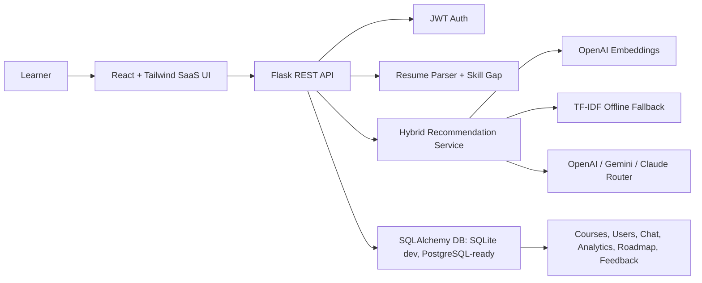

# ElevateAI

ElevateAI is an AI-powered course recommendation and career guidance platform for students, freshers, and career switchers. It combines a conversational assistant, resume-based skill-gap analysis, grounded course recommendations, roadmap generation, saved courses, and analytics in a modern React + Flask application.

## What It Demonstrates

- Full-stack SaaS architecture with React, Flask, SQLAlchemy, JWT auth, and Docker-ready deployment.
- Hybrid recommendation flow using semantic embeddings when available, cosine similarity, TF-IDF fallback, and grounded LLM explanations.
- Resume parsing with role-based skill-gap analysis and dynamic analytics.
- Production-minded safeguards: environment-based secrets, scoped CORS, request rate limiting, safe toast rendering, health checks, and CI.
- Recruiter-friendly UI with a premium dark dashboard, responsive layout, charts, roadmap, and course cards.

## Architecture



## Core Features

- AI chat assistant for career guidance and course discovery.
- Structured course cards with match score, rationale, and verified links.
- Resume PDF upload with extracted skills, missing skills, target-role comparison, and career insights.
- Analytics dashboard with radar chart, readiness score, learning trend, and completed/pending skill metrics.
- Personalized roadmap timeline based on skill gaps.
- Authentication, profile sync, saved courses, and anonymous session support.
- Multi-provider AI fallback chain with local graceful degradation.

## Tech Stack

Frontend:
- React 18, Vite, TailwindCSS, Framer Motion, Chart.js, Lucide icons, ReactMarkdown.

Backend:
- Flask, SQLAlchemy, Flask-JWT-Extended, Flask-CORS, scikit-learn, pypdf, OpenAI SDK, requests.

DevOps:
- Docker, Docker Compose, Nginx, Render blueprint, GitHub Actions CI.

Database:
- SQLite for local development.
- PostgreSQL-ready SQLAlchemy architecture with Alembic included for migrations.

## Local Setup

Backend:

```bash
cd backend
python -m venv .venv
.venv\Scripts\activate
pip install -r requirements.txt
copy ..\.env.example .env
python run.py
```

Optional ChromaDB vector store:

```bash
cd backend
pip install -r requirements-vector.txt
```

Embedding warm-up is disabled by default. Set `PRECOMPUTE_EMBEDDINGS=true` only when your OpenAI quota is available and you intentionally want to precompute course vectors at startup.

Frontend:

```bash
cd frontend
npm install
npm run dev
```

Default separated-development URLs:

- Frontend: `http://localhost:3000`
- Backend: `http://localhost:5000/api/health`

## Single-Service Version

ElevateAI can run as one service. React is built into `frontend/dist`, then Flask serves both the frontend and `/api/*` from the same port.

```bash
cd frontend
npm install
$env:VITE_API_URL="/api"
npm run build

cd ../backend
python run.py
```

Open:

- App: `http://localhost:5000`
- API health: `http://localhost:5000/api/health`

On Windows PowerShell:

```powershell
.\run-single.ps1
```

## Environment Variables

Copy `.env.example` to `.env` and configure:

```env
SECRET_KEY=replace-with-random-secret
JWT_SECRET_KEY=replace-with-random-jwt-secret
FLASK_DEBUG=false
CORS_ORIGINS=http://localhost:3000
DATABASE_URL=sqlite:///recommender.db
OPENAI_API_KEY=
GEMINI_API_KEY=
ANTHROPIC_API_KEY=
```

In production, never use default secrets and never commit `.env`.

## API Summary

- `POST /api/chat` - conversational recommendation flow.
- `POST /api/auth/register` - create account.
- `POST /api/auth/login` - get JWT.
- `GET /api/auth/profile` - authenticated profile.
- `POST /api/resume/upload` - parse PDF and return skill-gap analysis.
- `GET /api/stats/dashboard` - analytics metrics.
- `GET /api/roadmap/timeline` - personalized roadmap.
- `POST /api/courses/save` - save a course.
- `GET /api/courses/saved` - saved learning queue.
- `GET /api/courses` - filterable course catalog.
- `POST /api/courses/feedback` - collect recommendation feedback for future personalization.
- `GET /api/courses/personalization` - summarize saved, rated, and progress signals.
- `POST /api/roadmap/progress` - update roadmap progress.
- `GET /api/health` - service and AI-provider health.

Detailed API examples are available in `docs/API.md`.

## Testing And Quality

```bash
cd backend
pytest -q
flask --app run.py seed
flask --app run.py precompute-embeddings

cd frontend
npm run build
```

CI runs backend compilation, backend tests, and frontend production build.

## Deployment

Render single-service:
- Use `render.yaml`.
- The app is deployed as one Docker web service.
- Set production environment variables in the Render dashboard.
- Open the app at the service URL and the API at `/api/health`.

Vercel + Render:
- Deploy frontend to Vercel.
- Keep Flask API on Render.
- Use `vercel.json` to build `frontend/dist`.
- `/api/*` is rewritten to `https://elevateai-m23m.onrender.com/api/*`.
- Add the final Vercel domain to `CORS_ORIGINS` in Render if browser requests are blocked.

Single Docker deployment:

```bash
docker build -t elevateai .
docker run -p 5000:5000 --env SECRET_KEY=change-me --env JWT_SECRET_KEY=change-me elevateai
```

## Resume Description

ElevateAI - AI Career Guidance and Course Recommendation Platform

- Built a full-stack AI SaaS platform using React, Flask, SQLAlchemy, JWT, Docker, and Nginx.
- Implemented hybrid recommendation with semantic embeddings, cosine similarity, TF-IDF fallback, and grounded LLM explanations.
- Developed resume parsing and skill-gap analysis to generate personalized learning paths and readiness analytics.
- Designed a responsive dashboard with charts, roadmap visualization, saved courses, and AI chat workflow.
- Added production safeguards including scoped CORS, environment-based secrets, rate limiting, CI, health checks, and safe frontend rendering.

## Future Scope

- Add PostgreSQL + pgvector or ChromaDB for persistent nearest-neighbor vector search.
- Add collaborative filtering from saves, ratings, completions, and feedback.
- Add admin course management and course-quality scoring.
- Add certification tracking, progress history, weekly learning goals, and notifications.
- Add multilingual support and voice input for accessibility.
