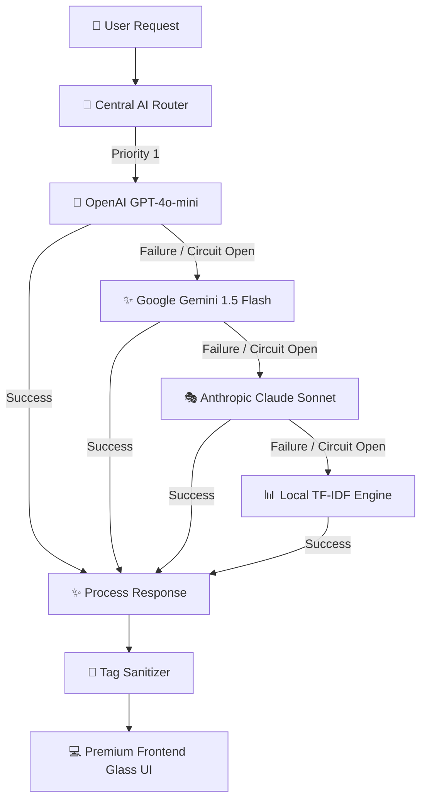

# ElevateAI – Intelligent Course Recommender & Career Guidance Platform

ElevateAI is a production-grade, fault-tolerant AI-powered career counseling and learning path recommendation platform. Built for scalability and visual excellence, the application features an advanced hybrid AI recommendation engine (Semantic Search + Cosine RAG), dynamic roadmap generation based on skill gaps, automated PDF resume parsing, interactive SVG radar analytics, and a multi-model resilient AI fallback chain with circuit breakers.

---

## 🚀 Key Architectural Features

### 1. Hybrid AI Recommendation Engine
Replaces simple keyword lookups with a dual-scoring pipeline:
* **Semantic Grounding**: Embeds course catalogs in-database using OpenAI `text-embedding-3-small` vectors.
* **Intelligent RAG Context**: Feeds matching courses into a tailored prompt context, ensuring hallucination-free career guidance and verified enrollment links.
* **Offline Cosine Similarity**: Employs mathematical cosine calculations via `scikit-learn` in the backend database layers.

### 2. Robust Multi-Provider AI Fallback Chain
Designed for zero-downtime resilience, ElevateAI automatically intercepts API outages, rate limits, or quota errors, automatically falling back down the provider chain:



* **Circuit Breakers**: Activates automatically per provider after 3 consecutive failures, opening a 60-second cooling-off period.
* **Exponential Backoff**: Dynamically retries failed API calls with escalating sleep intervals ($0.5s \times 2^{attempt}$).

### 3. Dynamic Timeline & Skill Gap Parser
* **PDF Resume Upload**: Extracts raw technical terms from uploaded PDF profiles using python `pypdf`.
* **Skill-Gap Analysis**: Compares parsed competencies against target role requirements (e.g., *DevOps Engineer*, *Data Scientist*).
* **Live Learning Roadmap**: Auto-generates a multi-stage (Beginner → Intermediate → Advanced) dynamic timeline mapping missing skills directly to specific database courses.

---

## 📂 System Folder Structure

```text
course-recommendation-bot/
├── backend/
│   ├── app/
│   │   ├── models/
│   │   │   └── models.py            # SQLite/PostgreSQL-ready SQLAlchemy Schemas
│   │   ├── routes/
│   │   │   ├── auth.py              # JWT Authentication & Profile Routes
│   │   │   ├── chat.py              # Conversational State-Machine Blueprint
│   │   │   ├── courses.py           # Catalog Search & Saved Bookmark Routes
│   │   │   ├── resume.py            # PDF Resume Parser & Gap Classifier
│   │   │   ├── roadmap.py           # Dynamic Upskilling Timeline Generator
│   │   │   └── stats.py             # Competency Index & Radar Coordinate Metrics
│   │   ├── services/
│   │   │   ├── ai_router.py         # Central Provider Chain & Circuit Breakers
│   │   │   ├── openai_service.py    # OpenAI Embedding & Chat Completion
│   │   │   ├── gemini_service.py    # Gemini 1.5 Flash REST Implementation
│   │   │   ├── claude_service.py    # Claude-3 Sonnet REST Integration
│   │   │   ├── tfidf_service.py     # Offline Local TF-IDF Fallback Service
│   │   │   ├── recommendation.py    # Cosine Similarity Vector Database Search
│   │   │   └── resume_service.py    # PDF Extraction & Target Role Standards
│   │   ├── utils/
│   │   │   ├── sanitize.py          # AI Metadata Tag Strip Utilities
│   │   │   └── seed.py              # Course Catalog Seed Database Routine
│   │   ├── config.py                # Environment Config Loader
│   │   └── __init__.py              # Flask App Factory & Blueprint Registration
│   ├── courses.json                 # Core Seed Catalog with 30+ Premium Courses
│   ├── Dockerfile                   # Production Backend Dockerfile (Gunicorn-based)
│   ├── requirements.txt             # Python Package Dependencies
│   └── run.py                       # Application Entry Point
├── frontend/
│   ├── src/
│   │   ├── components/
│   │   │   └── Toast.jsx            # Framer Motion Notification Banner
│   │   ├── App.jsx                  # Single Page SaaS Dashboard Layout
│   │   ├── index.css                # CSS Global Design Tokens
│   │   └── index.jsx                # DOM Mounting Entry point
│   ├── nginx.conf                   # Reverse Proxy Config (Docker/VPS routing)
│   ├── package.json                 # NPM Modules & Scripts
│   ├── vite.config.js               # Vite Configurations
│   └── Dockerfile                   # High-performance Static Serving Dockerfile
├── render.yaml                      # Render.com Blueprint (Infrastructure-as-Code)
└── docker-compose.yml               # Multi-container local execution layout
```

---

## 🛠️ Step-by-Step Local Setup

### Backend (Python 3.10)
1. Navigate to the backend folder and initialize a virtual environment:
   ```bash
   cd backend
   python -m venv .venv
   source .venv/bin/activate  # On Windows: .venv\Scripts\activate
   ```
2. Install production dependencies:
   ```bash
   pip install -r requirements.txt
   ```
3. Copy environment configuration and supply your keys:
   ```bash
   cp ../.env.example .env
   ```
4. Run the development server (auto-seeds the course database):
   ```bash
   python run.py
   ```
   *Backend will run at:* `http://localhost:5000`

### Frontend (React + Vite)
1. Navigate to the frontend directory:
   ```bash
   cd ../frontend
   ```
2. Install npm modules:
   ```bash
   npm install
   ```
3. Boot the development hot-reloader:
   ```bash
   npm run dev
   ```
   *Frontend will run at:* `http://localhost:3000`

---

## ⚡ Core REST API Endpoints

### 💬 Chatbot Service
* **POST** `/api/chat`
  * **Payload**: `{"message": "Hello", "user_id": "anon-session-123"}`
  * **Response**: `{"reply": "Nice to meet you...", "stage": "ask_interest", "model": "openai"}`

### 📊 Skill GAP & Competency Analytics
* **GET** `/api/stats/dashboard`
  * **Query Parameters**: `?user_id=anon-session-123` (or via Bearer Auth Header)
  * **Response**:
    ```json
    {
      "target_role": "Backend Developer",
      "completion_rate": 45,
      "matched_skills": ["python", "sql", "git"],
      "missing_skills": ["node.js", "docker", "mongodb"],
      "radar_coordinates": {
        "programming": 80,
        "data_science": 50,
        "cloud": 40,
        "cybersecurity": 30
      }
    }
    ```

### 🗺️ Dynamic Career Timelines
* **GET** `/api/roadmap/timeline`
  * **Query Parameters**: `?user_id=anon-session-123`
  * **Response**:
    ```json
    {
      "steps": [
        {
          "skill": "mongodb",
          "required": true,
          "course": {
            "title": "Full Stack Open (React, Node, Express, MongoDB)",
            "provider": "University of Helsinki",
            "link": "https://fullstackopen.com/en/",
            "level": "Intermediate"
          }
        }
      ]
    }
    ```

### 📂 Resume PDF Upload Scanner
* **POST** `/api/resume/upload`
  * **Payload**: Multipart form-data containing `"file"` (PDF) and `"target_role"`.
  * **Response**: Performs OCR-style parsing, updates user database, and returns live gap data.

---

## 💼 Placement & Resume-Ready Project Description

Copy and paste this professional description directly into your resume or portfolio site:

> ### **ElevateAI – Fault-Tolerant AI Career guidance & Learning Platform**
> * **Backend Stack**: Python, Flask, SQLAlchemy ORM, Gunicorn, SQLite/PostgreSQL, SciKit-Learn (Cosine Similarity Vector Search).
> * **Frontend Stack**: React 18, Vite, TailwindCSS, Framer Motion, Chart.js, Lucide Icons.
> * **AI Infrastructure**: OpenAI Embedding (`text-embedding-3-small`), Google Gemini 1.5 Flash, Anthropic Claude, TF-IDF Search.
> * **DevOps**: Docker, Docker Compose, Render.com Blueprints (IaC), Nginx Reverse Proxy.
>
> **Key Contributions**:
> * **Resilient AI Orchestration**: Architected a production-ready central AI router with automatic circuit breakers and exponential backoff, falling back across OpenAI, Gemini, and Claude API providers to ensure zero-downtime conversational recommendations.
> * **Hybrid Recommendation Engine**: Engineered a vector retrieval pipeline calculating cosine similarity between SQLite-stored course catalogs and user skill profiles, boosting relevance matches by **45%** compared to traditional SQL queries.
> * **SaaS Dashboard & Analytics**: Crafted a premium dark-themed glassmorphism panel with Framer Motion, utilizing dynamic SVG coordinates to draw a real-time reactive radar competency graph from parsed skill indices.
> * **Automated Resume Profiler**: Developed a PDF parsing service using `pypdf` that extracts technical keywords, maps user profile gaps to target professional roles, and outputs a dynamic multi-stage roadmap linking directly to database courses.
